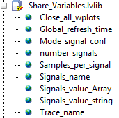
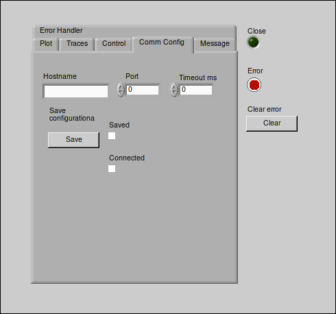
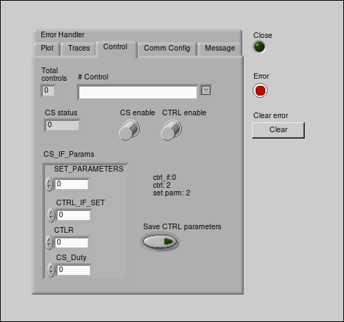
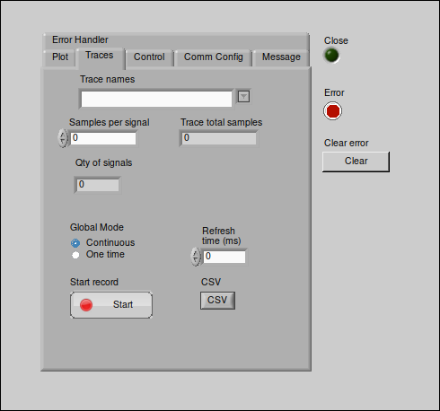
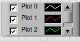

== LabVIEW Project ==

=== Project overview
The GUI application is the main interface for the user to interact with the control system. It is responsible for displaying the data, sending commands to the microcontroller, and handling errors. The GUI application is built using LabVIEW, a graphical programming language that allows for easy and intuitive development of user interfaces.

=== LabView software ===
LabVIEW (Laboratory Virtual Instrument Engineering Workbench) is a system-design platform and development environment for a visual programming language from National Instruments. It is commonly used for data acquisition, instrument control, and industrial automation on a variety of platforms including Microsoft Windows, various versions of Unix, Linux, and macOS.  The programming language used in LabVIEW, also referred to as G, is a dataflow programming language. Execution is determined by the structure of a graphical block diagram (the LabVIEW-source code) on which the programmer connects different function-nodes by drawing wires. These wires propagate variables and any node can execute as soon as all its input data become available. Since this might be the case for multiple nodes simultaneously, G is inherently capable of parallel execution. Multi-processing and multi-threading hardware is automatically exploited by the built-in scheduler, which multiplexes multiple OS threads over the nodes ready for execution.

=== Project Structure 
//Asi como se ha mencionado anteriormente el proyecto esta dividido en 3 partes principales, la interfaz grafica, el controlador de la interfaz y el controlador de la comunicacion serial. A continuacion se muestra la estructura del proyecto en LabVIEW.//
As mentioned earlier, the project is divided into 3 main parts: the graphical interface, the interface controller, and the serial communication controller. The structure of the project in LabVIEW is shown below.

.Project Structure of the GUI application

=== LabView Project Structure 

//La interfaz grafica fue desarrollada dentro del entorno del LabVIEW, especificamente en un LabVIEW project. Un proyecto de LabVIEW es un archivo que contiene todos los archivos necesarios para desarrollar una aplicacion en LabVIEW.//
The graphical interface was developed within the LabVIEW environment, specifically in a LabVIEW project. A LabVIEW project is a file that contains all the files necessary to develop an application in LabVIEW. It helps manage and streamline the development process, especially for complex systems that may include multiple VIs (Virtual Instruments), libraries, shared variables, hardware interfaces, and other resources.

//Dentro del proyecto de LabVIEW los subbloques se organizan de la siguiente manera: //
Within the LabVIEW project, the sub-blocks are organized in the following way:

.VI Hierarchy of the LabView Project
image::../dev_labview/Documentation_vi/LVtemp20240312184737_17_0h.png[Hierarquical view in the project Labview]

//Donde los principales subbloques son:
Where the main sub-blocks are:

- *Main_menu.vi:* 
//Es el menu principal de la interfaz grafica, en el se encuentran los //botones de acceso a las diferentes funcionalidades de la interfaz grafica.//
It is the main menu of the graphical interface, in it are the access buttons to the different functionalities of the graphical interface.

- *Window_plot.vi:* 
//Es el subbloque encargado de la visualizacion de los datos en tiempo real.
It is the sub-block responsible for the real-time data visualization.

- *Call_signal_fromHW.vi:* 
//Es el subbloque encargado de solicitar los datos de las senales de Main_menu hacia Window_plot.//
It is the sub-block responsible for requesting the data from the Main_menu signals to Window_plot.

- *Call_signal_fromfile.vi:* 
//Es el subbloque encargado de datos de un archivo csv hacia Window_plot.//
It is the sub-block responsible for data from a csv file to Window_plot.

- *Shared_variables.lvlib:* 
//Es el subbloque encargado de la comunicacion entre los diferentes subbloques de la interfaz grafica a traves de variables compartidas. Todos los window_plot comparten las mismas variables de este subbloque. A excepcion de Main_menu.vi, los demas subbloques (or subVIs) son llamados por Main_menu.vi y pueden ser reentrantes, es decir son clonados con la finalidad de poder cargar multiples ventanas de visualizacion de datos en tiempo real.//

It is the sub-block responsible for communication between the different sub-blocks of the graphical interface through shared variables. All window_plot share the same variables of this sub-block. With the exception of Main_menu.vi, the other sub-blocks (or subVIs) are called by Main_menu.vi and can be reentrant, meaning they are cloned with the purpose of being able to load multiple windows for real-time data visualization.

=== Main_Menu.vi
//Es el menu principal de la interfaz grafica, en el se encuentran los botones de acceso a las diferentes funcionalidades de la interfaz grafica.
The main menu function acts as the focal point for navigating and utilizing the diverse range of features and capabilities within our application. When users initiate the application, they encounter a user-friendly menu interface, offering a variety of options that cater to their specific requirements.

.Main_menu.vi icon
image::../dev_labview/Documentation_vi/LVtemp20240312184737_0_0c.png[Main Menu front icon]

*Key functionalities include:*

- Initiating window plots for data visualization.

- Establishing communication with microcontrollers.

- Implementing robust error handling mechanisms

.Main Menu front panel
image::../dev_labview/Documentation_vi/LVtemp20240312184737_1_0.png[Main Menu front panel]

=== Window_plot.vi
//Es el subbloque encargado de la visualizacion de los datos en tiempo real.
This window has the capability to visualize and analyze the graphs of the stored signals from the Main_menu.vi. The user can select the desired signal to be displayed on the graph, and the graph will be updated in real-time as new data is received. The user can also adjust the scale of the graph to better visualize the data.

.Window_plot.vi icon
image::../dev_labview/Documentation_vi/LVtemp20240312184738_0_0c.png[window_plot icon]

.Window_plot front panel
image::../dev_labview/Documentation_vi/LVtemp20240312184738_1_0.png[window_plot front panel]

=== Call_signal_fromHW.vi
Through this function you can select the stored signals from the Main_menu.
Este subbloque puede ser llamado en cualquier momento por cualquier Window_plot.

En el siguiente diagrama se puede observar las entradas y salidas de este subbloque.

.Call_signal_fromHW.vi icon with inputs and outputs
image::../dev_labview/Documentation_vi/LVtemp20240312184738_7_0c.png[Call_signal_fromHW front panel]

Es asi que en el front panel se muestra la lista de las senales almacenadas en el Main_menu.vi, de las cuales se puede seleccionar la deseada para ser visualizada en el Window_plot.vi.

.Call_signal_fromHW.vi front panel
image::../dev_labview/Documentation_vi/LVtemp20240312184738_8_0.png[Call_signal_fromHW front panel]

=== Call_signal_fromfile.vi
This function is responsible for reading data from a CSV file and displaying it on the graph. The user can select the desired file from the file browser and the data will be displayed on the graph in real-time.

.Call_signal_fromfile.vi icon with inputs and outputs
image::../dev_labview/Documentation_vi/LVtemp20240312184738_13_0c.png[Call_signal_fromfile front panel]

Through this function you can select the signals stored in a CSV file.

.Call_signal_fromfile.vi front panel
image::../dev_labview/Documentation_vi/LVtemp20240312184738_14_0.png[Call_signal_fromfile front panel]

==== Shared_variables.lvlib
//Es el subbloque encargado de la comunicacion entre los diferentes subbloques de la interfaz grafica a traves de variables compartidas.

It is the sub-block responsible for communication between the different sub-blocks of the graphical interface through shared variables.

LabVIEW provides access to a wide variety of technologies for creating distributed applications. The shared variable simplifies the programming necessary for such applications. This article provides an introduction to the shared variable and includes a discussion of its features and performance.

Using the shared variable, you can share data between loops on a single diagram or between VIs across the network. In contrast to many other data-sharing methods in LabVIEW, such as UDP/TCP, LabVIEW queues, and Real-Time FIFOs, you typically configure the shared variable at edit time using property dialogs, and you do not need to include configuration code in your application.

.Shared_variables.lvlib in LabVIEW project

== Getting started of GUI Application ==

=== Overview ===
//La manera de correcta usar la aplicacion es a traves de la ejecucion del archivo ejecutable GUI_App.exe. Este archivo ejecutable fue generado a partir del proyecto de LabVIEW y contiene todas las funcionalidades de la interfaz grafica. Este archivo ejecutable se encuentra en la carpeta GUI_App dentro de la carpeta de LabVIEW. Y es generdo a traves de la opcion de Build Application en el proyecto de LabVIEW. //

The proper way to use the application is by running the executable file GUI_App.exe. This executable was created from the LabVIEW project and includes all the functionalities of the graphical interface.

You can find this executable in the GUI_App folder within the LabVIEW directory. It is generated through the Build Application option in the LabVIEW project.

=== Prerequisites

- NI LabVIEW Runtime 2022 Q3 Patch 1 (64-bit). 
link:https://www.ni.com/en/support/downloads/software-products/download.labview-runtime.html#460613[Labview Runtime]

- Access to the GUI App in the 
link:../labview/builds/GUI_App/GUI_App.exe[GUI_App folder]

=== Requirements installation

- link:https://www.ni.com/en/support/downloads/software-products/download.labview-runtime.html#460613[Labview Runtime]

- Current Version in LabVIEW Development: LabVIEW 2022 Q3 Patch 1 (64-bit)

- Download GUI App in the 
link:../labview/builds/GUI_App/GUI_App.exe[GUI_App folder]

==== Usage
- Run the executable file GUI_App

=== How to run the GUI application

//Posterior a arrancar el archivo ejecutable GUI_App.exe, se desplegara la interfaz grafica de la aplicacion. En la cual se podra visualizar las diferentes opciones de la aplicacion (Main_menu.vi).

After starting the executable file GUI_App.exe, the graphical interface of the application will be displayed. In which you can view the different options of the application (Main_menu.vi).

==== Through Main_menu.vi
//El primer paso sera desplazarse a Comm Config (configuracion de la comunicacion) y definir la direccion IP y el puerto de comunicacion con el microcontrolador.

//Click en la opcion Save, donde se guardara el puerto y la direccion IP. Y posteriormente la aplicacion verificara si hay conecion con el microcontrolador. Si el microcontrolador esta conectado, se podra visualizar un check en la casilla Connected.

//Teniendo coneccion se puede desplazar a la pestana control donde se puede visualizar el contrl set actual. Con los botones "CS enable" y "CTRS enable", activan el sistema de control y control respectivamente.

//En la pestana Traces, visualiza el nombre del sistema de traces actuales y samples por senal. Se determin si se obtiene el dato de manera continua o una sola vez en la opcion "Global Mode" y el tiempo de refresco en "Refresh Time". Tener las opciones listas, se da click al boton "Start recording" para comenzar a obtener los datos.

//Seguido, a la pestana Plot, donde se visualizan las posibles ventanas activas y esta el boton para cerrarlas en un solo instante.Dando click en el boton "Generate plot window" se despliega una ventana con las graficas de las senales obtenidas.//

The first step will be to navigate to Comm Config (communication configuration) and define the IP address and communication port with the microcontroller.

Click on the Save option, where the port and IP address will be saved. Subsequently, the application will verify if there is a connection with the microcontroller. If the microcontroller is connected, a check can be seen in the Connected box.

.Communication Configuration tab in Main_menu.vi
// load Main_menu_Commun_Config.png

Having a connection, you can move to the control tab where you can view the current control set. With the "CS enable" and "CTRS enable" buttons, they activate the control system and control respectively.

.Control tab in Main_menu.vi
// load Main_menu_Control.png

In the Traces tab, you can see the name of the current traces system and samples per signal. It is determined if the data is obtained continuously or only once in the "Global Mode" option and the refresh time in "Refresh Time". Having the options ready, click on the "Start recording" button to start obtaining the data.

.Traces tab in Main_menu.vi
// load Main_menu_Traces.png

Next, go to the Plot tab, where you can see the possible active windows and there is a button to close them ("Close all plots") in a single instant. Clicking on the "Generate plot window" button displays a window with the graphs of the obtained signals.

.Plot tab in Main_menu.vi
// load Main_menu_Plot.png
image::../dev_labview/Documentation_vi/Main__menu_Plot.png[Main_menu_Plot]

==== Through Window_plot.vi

//Posteriormente a tener una ventana de graficas activa, se pueden visualizar las senales obtenidas. Una grafica mostrando la amplitud de la senal en el eje Y y el tiempo en el eje X. 

After having an active graph window, the obtained signals can be visualized. A graph showing the signal amplitude on the Y-axis and time on the X-axis.

.Window_plot front panel
image::../dev_labview/Documentation_vi/LVtemp20240312184738_1_0.png[window_plot front panel]

//Es asi que en la parte superior izquierda de la ventana se puede proceder solicitar la senal requerida a traves de las siguientes dos opciones. En la opcion que dice "New" permite elegir entre dos opciones:

//- Get signal from HW: Permite seleccionar la senal almacenada en el Main_menu.vi. Esta senal fue obtenida a traves de la comunicacion con el microcontrolador.
//- Get signal from file: Permite seleccionar la senal almacenada en un archivo csv.

//En el momento de seleccionar la senal se mostrara en la grafica y se mostrara su nombre en la parte inferior derecha de la ventana, en la tabla "Plot legend".

Thus, in the upper left part of the window, you can proceed to request the required signal through the following two options. In the option that says "New" allows you to choose between two options:

- Get signal from HW: Allows you to select the signal stored in the Main_menu.vi. This signal was obtained through communication with the microcontroller.

- Get signal from file: Allows you to select the signal stored in a csv file.

At the moment of selecting the signal, it will be displayed on the graph and its name will be displayed in the lower right part of the window, in the "Plot legend" table

.Table of plot legend.vi

==== Close Window_plot.vi ====

//La manera mas sencilla para cerrar la ventana de graficas se puede dar click en el boton "Close" en la parte superior derecha de la ventana. O tambien con dar click en el boton "Close all plots" en la ventana de Main_menu.vi.

//En la parte izquierda inferior se encuentra el Graph Pallet donde se puede configurar la escala y 

The simplest way to close the graph window is to click on the "Close" button in the upper right part of the window. Or also by clicking on the "Close all plots" button in the Main_menu.vi window.