== LabView software ==
LabVIEW (Laboratory Virtual Instrument Engineering Workbench) is a system-design platform and development environment for a visual programming language from National Instruments. It is commonly used for data acquisition, instrument control, and industrial automation on a variety of platforms including Microsoft Windows, various versions of Unix, Linux, and macOS.  The programming language used in LabVIEW, also referred to as G, is a dataflow programming language. Execution is determined by the structure of a graphical block diagram (the LabVIEW-source code) on which the programmer connects different function-nodes by drawing wires. These wires propagate variables and any node can execute as soon as all its input data become available. Since this might be the case for multiple nodes simultaneously, G is inherently capable of parallel execution. Multi-processing and multi-threading hardware is automatically exploited by the built-in scheduler, which multiplexes multiple OS threads over the nodes ready for execution.

== GUI App - LabVIEW

=== Project overview
The GUI application is the main interface for the user to interact with the control system. It is responsible for displaying the data, sending commands to the microcontroller, and handling errors. The GUI application is built using LabVIEW, a graphical programming language that allows for easy and intuitive development of user interfaces.

_Built with and for_
- Labview

=== Project Structure

.Project Structure of the GUI application

.VI Hierarchy of the project
image::../dev_labview/Documentation_vi/LVtemp20240312184737_17_0h.png[Hierarquical view in the project Labview]

