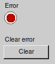
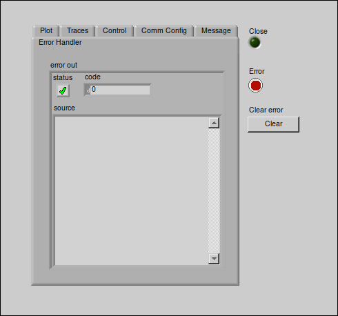
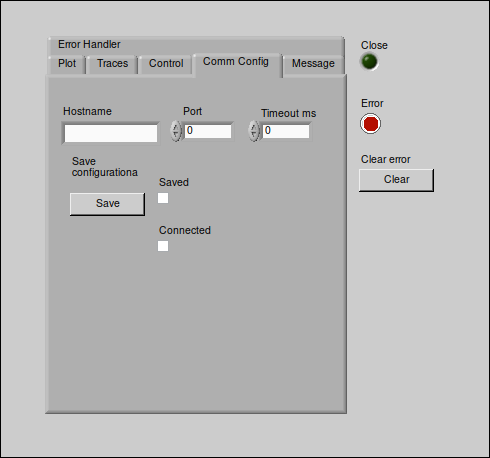

== Main_menu.vi in detail ==

=== Overview ===

Main_menu.vi is the main VI of the application. It is the first VI that is called when the application is launched. It is responsible for creating the main window of the application and for managing the different sub-VIs that are called from the main window.
The Main_menu.vi is divided into two main sections: the front panel and the block diagram. The front panel is the user interface of the VI, where the user can interact with the application. The block diagram is the code that controls the behavior of the VI.
Thus, the elements found in the front panel of Main_menu.vi will be described below.

//Es asi que se describiran a constinuacion los elementos que se encuentran en el front panel de Main_menu.vi.
//En el front panel se encuentran los siguientes elementos:
In the front panel, the following elements are found:

=== Elements ===

//- Indicador "Error" : Este indicador se encarga de mostrar los errores que se han generado en la aplicacion. Cada vez que se genera un error en la aplicacion, este indicador se activa. Al suceder este se tiene que trasladar a la pestana "Error Handler" para ver el error que se ha generado. Y por otra parte presionar el boton "Clear error" para limpiar los errores que se han generado en la aplicacion y reanudar el funcionamiento de la aplicacion. Ya que la aplicacion se detiene cuando se genera un error.

//- Boton "Clear error" : Este boton se encarga de limpiar los errores que se han generado en la aplicacion. Cada vez que se presiona este boton, se limpian los errores que se han generado en la aplicacion.

- *Error* Indicator: This indicator is responsible for displaying the errors that have been generated in the application. Each time an error is generated in the application, this indicator is activated. When this happens, you have to move to the "Error Handler" tab to see the error that has been generated. On the other hand, press the "Clear error" button to clear the errors that have been generated in the application and resume the operation of the application. Since the application stops when an error is generated.

- *Clear error* Button: This button is responsible for clearing the errors that have been generated in the application. Each time this button is pressed, the errors that have been generated in the application are cleared.

.Indicator "Error" and button "Clear error"
// load Main_menu_Error_button.png

=== Tab Error Handler ===

// En esta pestana se muestra el error que se ha generado en la aplicacion. Ademas, se muestra el codigo del error y la descripcion del error. Para limpiar el error generado se debe presionar el boton *Clear error* que se encuentra a la derecha de la pestana "Error Handler".

In this tab, the error that has been generated in the application is displayed. In addition, the error code and the error description are displayed. To clear the generated error, you must press the *Clear error* button located to the right of the 'Error Handler' tab."

.Error Handler tab in Main_menu.vi
// load Error Handler.png

=== Tab Plot

In this tab you can see the possible active windows in the table *List of active windows*. In the bottom, there is a button to close them *Close all plots* in a single instant. Clicking on the *Generate plot window* button displays a window with the graphs of the obtained signals.

.Plot tab in Main_menu.vi
// load Main_menu_Plot.png
image::..//documentation_log/graphs_doc_vi/Main__menu_Plot.png[Main_menu_Plot]

=== Tab Traces

In the Traces tab, you can see the name of the current traces system in the microcontroller *Trace names*.

In *Samples per signal* is visualized the current samples per signal that are being obtained and can be set the quantity to get from the microcontroller.

The indicator *Trace total samples* shows the total samples that are being obtained from the microcontroller. And the indicator *Qty of signals* shows the quantity of signals that are being obtained from the microcontroller.

In *Global Mode* is determined if the data is obtained continuously or only once.

The *Refresh time (ms)* determines the time that the application waits to obtain the data again.

Finally, the *Start record* button to start obtaining the data from microcontroller depending on the previous configurations. It is possible to stop the data acquisition by pressing again the *Start record* button. Changing set up values will be applied when the data acquisition pressing again the *Start record* button.

The button *CSV* is used to save the all the data obtained in a CSV file.

.Traces tab in Main_menu.vi
// load Main_menu_Traces.png

=== Tab Control

//En el selectionador *# Control* se muestra los controles disponibles para ser seleccionados. A su vez en *Total controls* se muestra la cantidad de controles presetes en el sistema de control (CS).

//En *CS status* se muestra el estado del sistema de control. El valor dependera de la configuracion del sistema de control asignada. _Nota: Revisar configuracion del sistema de control para interpretar su status_.

//Enseguida el boton *CS enable* habilita el sistema de control, indicando un cambio de color en el boton. Asi como el boton *CTRL enable* activa el control seleccionado.

In the *# Control* selector, the available controls to be selected are displayed. In turn, in *Total controls*, the number of preset controls in the control system (CS) is displayed.

In *CS status*, the status of the control system is displayed. The value will depend on the assigned control system configuration. _Note: Check the control system configuration to interpret its status._

Next, the *CS enable* button enables the control system, indicating a color change in the button. Just like the *CTRL enable* button activates the selected control.

.Control tab in Main_menu.vi
// load Main_menu_Control.png
image::../documentation_log/graphs_doc_vi/Main__menu_Control.png[Main_menu_Control]

==== Section CS_IF_Params
//En el bloque CS_IF_Params se encuentran cuatro controles numericos que permiten configurar los parametros de la interfaz de control. Estos parametros son:

In the *CS_IF_Params* block, there are four numeric controls that allow you to configure the parameters of the control interface. These parameters are:
- SET_PARAMETERS
- CTRL_IF_SET
- CTRL
- CS_DUTY

//Al establecer los valores de estos parametros, se debe presionar el boton *Save CTRL parameters* para que los cambios sean aplicados en el microcontrolador. Esta accion puede ser realizada en cualquier momento ya que representa el envio de un paquete datos al microcontrolador como se muestra en la siguiente tabla. 

Upon setting the values of these parameters, the *Save CTRL parameters* button must be pressed so that the changes are applied to the microcontroller. This action can be performed at any time as it represents the sending of a data packet to the microcontroller as shown in the following table.

.Message CS_IF_Params command structure
[frame=ends]
|===
|SET_PARAMETERS|CTRL_IF_SET|CTRL|CS_DUTY
|===

//_Cabe aclarar que estos parametros dependeran de la configuracion desarrollada en el controlador. Para se requerira revisar la documentacion del desarrollo de microncontrolador._

_It should be clarified that these parameters will depend on the configuration developed in the controller. It will require reviewing the documentation of the microcontroller development._

=== Tab Comm Config

La pestana Comm Config representa la seccion para configurar la comunicacion entre el microcontrolador y la aplicacion. En esta seccion se encuentran los siguientes elementos de control:
- *Hostname*: Indicador para mostrar el nombre del host o IP Address a comunicar.
- *Port name*: Seleccionador para elegir el puerto de comunicacion.
- *Timeout ms*: Indicador para mostrar el tiempo de espera de la comunicacion.
- *Save configuration*: Boton para guardar la configuracion de la comunicacion.

The Comm Config tab represents the section to configure the communication between the microcontroller and the application. In this section, the following control elements are found:

- *Hostname*: Indicator to display the host name or IP Address to communicate.
- *Port*: Selector to choose the communication port.
- *Timeout ms*: Indicator to display the communication wait time.
- *Save configuration*: Button to save the communication configuration.

Clicking on the *Save* button, port and IP address will be saved in the application and the *Saved* box will have and check mark.

Subsequently, the application will verify if there is a connection with the microcontroller. If the microcontroller is connected, a check mark will be in the *Connected* box.

.Communication Configuration tab in Main_menu.vi
// load Main_menu_Commun_Config.png

=== Tab Message

//Esta pestana solamente se utiliza para enviar mensajes y datos a la ventanas activas en la aplicacion. Solamente los mensajes se podran visualizar dentro de diagrama de bloques de la respectiva ventana activa. 

This tab is only used to send messages and data to the active windows in the application. Only the messages can be viewed within the block diagram of the respective active window.

*Just for development purposes*

.Message tab in Main_menu.vi
// load Main_menu_Message.png
image::../documentation_log/graphs_doc_vi/Main__menu_Message.png[Main_menu_Message]

