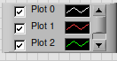

== Window_plot.vi

=== Overview ===

This VI is used to plot data in a window. It is a simple wrapper around the XY Graph control where the signal data is plotted.

=== Elements ===

==== Waveform Graph ====

The waveform graph displays one or more plots of evenly sampled measurements. 

.Window_plot front panel
image::../dev_labview/Documentation_vi/LVtemp20240312184738_1_0.png[window_plot front panel]

===== Properties =====

The waveform graph has the following properties:

- Graph Pallet

.Graph Pallet

- Table of plot legend

.Table of plot legend

==== Offset Control

==== Get signal from HW

==== Get signal from Signal
