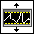
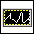

== Window_plot.vi

=== Overview ===

This VI is used to plot data in a window. It is a simple wrapper around the XY Graph control where the signal data is plotted.

=== Elements ===

==== Waveform Graph ====

The waveform graph displays one or more plots of evenly sampled measurements. 

.Window_plot front panel
image::../dev_labview/Documentation_vi/LVtemp20240312184738_1_0.png[window_plot front panel]

===== Properties =====

The waveform graph has the following properties:

- Graph Pallet

The Graph Palette in LabVIEW is a set of tools and options that allow you to customize the appearance and behavior of a graph or chart. It is typically available when you right-click on a graph or chart control in the front panel window link:https://www.ni.com/docs/en-US/bundle/ni-vision-builder-for-automated-inspection-configuration-help/page/vbai_config/graphpalette.html[Graph Palette Documentation].

.Graph Pallet
image::../dev_labview/Documentation_vi/Windows_p_Graph_pallete.PNG[Graph pallete in Window_plot.vi]

Here are some of the features you can access from the Graph Palette:

*Cursor Movement Tool:* No function.

image::../dev_labview/Documentation_vi/Graph pallet/noloc_graph_cursor.gif[Cursor]

*Zoom:* Zooms in and out of the display.

*Zoom to Rectangle:* Zooms in on a rectangle that you draw on the display area.

*X-zoom:* Zooms in along the x-axis.

*Y-zoom:* Zooms in along the y-axis.

*Zoom In about Point*: Autoscales the chart to fit in the display area.

*Zoom Out about Point:* Zooms in on a point.

image::../dev_labview/Documentation_vi/Graph pallet/noloc_zoom_outaboutpoint.gif[Zoom Out about Point]

*Zoom to Fit:* Zooms out from a point.

image::../dev_labview/Documentation_vi/Graph pallet/noloc_zoom_inaboutpoint.gif[Zoom to Fit]

*Panning Tool:* Repositions the plot on the display.

image::../dev_labview/Documentation_vi/Graph pallet/noloc_graph_repo.gif[Panning Tool]

- Table of plot legend

The plot legend in LabVIEW is a graphical feature that provides information about the different plots or data series displayed in a graph or chart. It helps users distinguish between multiple data sets and understand what each plot represents. Here’s a detailed overview of the table of plot legend in LabVIEW:

.Table of plot legend
image::../dev_labview/Documentation_vi/Windows_p_Plot_leyend_table.PNG[Plot legend in Window_plot.vi]

Components of the Plot Legend

*Plot Name:* Displays the name or label of each plot. Can be customized to provide meaningful names that describe the data.

*Line Style and Color:* Shows the style (solid, dashed, dotted) and color of the line associated with each plot. Helps visually differentiate between multiple plots on the same graph.

*Point Style:* Indicates the style of data points (circle, square, triangle) used in the plot. Useful for distinguishing between data sets that might otherwise look similar.

*Visibility Toggle:* Allows users to hide or show specific plots without removing the data from the graph. Useful for focusing on specific data sets while temporarily ignoring other

==== Offset Control

The offset control is used to set the offset of the signal.
The first rectangle is used to select the signal to be offset. And follows the slider to set the offset value.

.Offset Control

==== Get signal from HW

The Get signal from HW is used to get the signal from the hardware.

.Get signal from HW window
image::../dev_labview/Documentation_vi/LVtemp20240312184738_8_0.PNG[Get signal from HW in Window_plot.vi]

Features of Get signal from HW:

- Plot window: Shows the current name of the caller window_plot.vi.
- Clone Name: Shows the name of the clone version of Call_signal_fromfile.vi.
- Select signal: Select the signal to be plotted.

==== Get signal from file

The Get signal from file is used to get the signal from a csv file.

image::../dev_labview/Documentation_vi/LVtemp20240312184738_14_0.png[Get signal from file in Window_plot.vi]

Features of Get signal from HW:

- Plot window: Shows the current name of the window.
- Clone Name: Shows the name of the clone version of the window_plot.vi .
- From file (csv): Select the csv file to be plotted.
- Y data: Select the column to be plotted as Y.
- X data: Select the column to be plotted as X.

